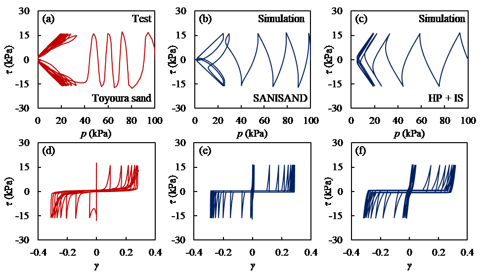
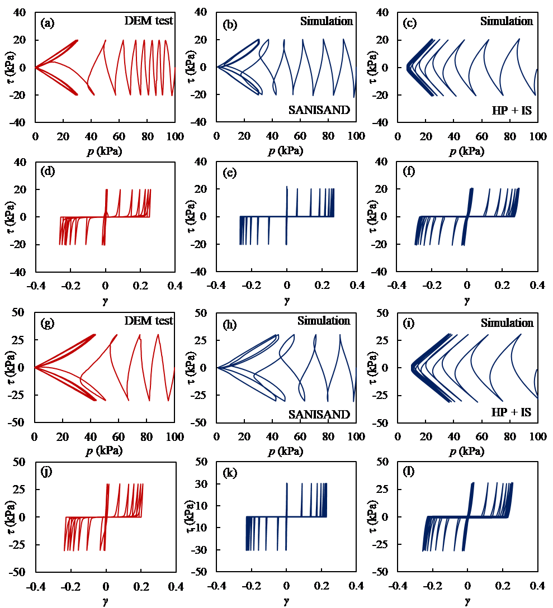

# A Simplified Framework for Simulating Large Post‑Liquefaction Strains in Sand

This repository contains MATLAB implementations of a novel post‑liquefaction large‑strain constitutive framework. The framework is embedded in two widely used constitutive models: the **SANISAND** bounding surface model and the **HP+ISA** hypoplastic model with intergranular strain. The proposed mechanism enables a realistic description of the progressive accumulation of shear strains under cyclic loading, up to a saturated value, while ensuring numerical stability near zero effective stress.

## Key Features

- Uses **minimum effective stress** and **current liquefaction shear strain** as state criteria to smoothly switch between liquefied and non‑liquefied states.
- Incorporates micro‑mechanical insights from DEM simulations (e.g., evolution of MNPD and dilatancy potential) into a physically motivated accumulation law for post‑liquefaction shear strain.
- Introduces only a few additional parameters (`κ`, `γₐₛ₀`, `η_ε`, `η_γ`) that are easy to calibrate.
- Successfully implemented in both the SANISAND bounding surface model and the HP+ISA hypoplastic model, avoiding the numerical instabilities often encountered near zero effective stress.

## Theoretical Framework

### Liquefaction State Criterion

- The soil enters the liquefied state when the mean effective stress `p` falls below a threshold `p_min`.
- In the liquefied state, the stress state is kept constant while strains continue to develop.
- Exit from the liquefied state is governed by a combined condition involving shear strain and volumetric strain:

$$
\gamma_a \cdot g(\theta_\varepsilon) + \varepsilon_{\text{vmono}}{\eta_\varepsilon} \geq \gamma_0
$$

where `γ_a` is an internal variable representing the directional shear strain, `γ_0` is the accumulated shear strain in the current liquefaction episode, and `η_ε` is a material parameter.

### Accumulation of Post‑Liquefaction Shear Strain

The directional shear strain `γ_a` increases with each liquefaction episode and approaches a saturated value `γ_as`:

$$
\gamma_a^{\text{new}} = \gamma_a^{\text{pr}} + \eta_\gamma \cdot (\gamma_{as} - \gamma_a^{\text{pr}})
$$

- `γ_as` is the saturated shear strain, linked to the initial void ratio via a linear relationship (`κ` and `γₐₛ₀`).
- `η_γ` controls the rate of accumulation.
- This evolution law is motivated by the DEM‑observed behavior of the mean neighboring particle distance (MNPD).

### Model Implementation

#### SANISAND Model
- A dedicated branch is added to the original SANISAND formulation to handle the liquefied state.
- Upon exiting liquefaction, the dilatancy rate is forced to be non‑negative to ensure that the effective stress increases and the soil does not immediately re‑liquefy.

#### HP+IS Model
- A dynamic `p_min` detection algorithm is implemented because the hypoplastic model alone may not always reach a predefined minimum stress.
- An iterative correction is applied to the deviatoric stress increment when exiting liquefaction to guarantee a positive mean stress increment in the next step.

## Model Validation

### Parameter Calibration

The additional parameters are calibrated as follows:

| Parameter | Physical Meaning | Calibration Method |
|----------|------------------|---------------------|
| `κ`, `γₐₛ₀` | Relationship between saturated shear strain and initial void ratio | Linear fit from tests on specimens with different void ratios |
| `η_γ` | Accumulation rate | Ratio of the shear strain after first liquefaction to the saturated value |
| `η_ε` | Influence of volumetric strain | Can be set to 1.0 for simplicity or calibrated from partial‑drainage tests |

### Validation Examples

#### 1. Undrained Cyclic Tests on Toyoura Sand
- The model captures the progressive reduction of effective stress before liquefaction and the accumulation of shear strains after liquefaction.
- Both stress paths (`p–q`) and stress–strain curves (`γ–q`) are in good agreement with experimental data.

#### 2. DEM Numerical Tests
- Simulations are performed for two different initial void ratios and cyclic stress ratios.
- The model reproduces the post‑liquefaction strain accumulation observed in DEM, demonstrating its ability to simulate the entire process from pre‑liquefaction to post‑liquefaction.

### Parameter Sensitivity

- **`κ`**: Controls the saturated shear strain `γ_as` without affecting pre‑liquefaction behavior.
- **`η_γ`**: Determines how fast the shear strain accumulates; the final saturated value remains unchanged.
- **`p_min`**: Must be set small enough (or automatically determined) to allow the liquefaction branch to be activated; the final strain amplitude is largely insensitive to its exact value once the mechanism is triggered.

## Running the Code

### Requirements

- MATLAB R2018b or later.
